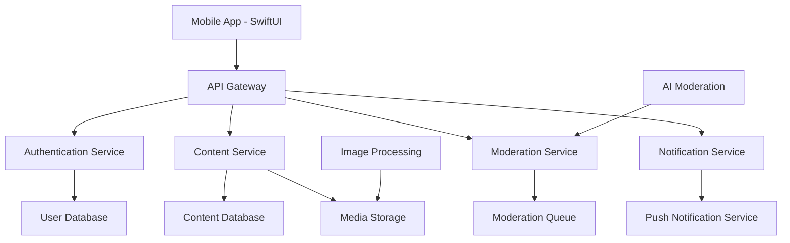

# Design Document

## Overview

Dirt is a men-only dating review and community platform that allows users to anonymously share dating experiences, review profiles, and discuss dating strategies. The app emphasizes safety, anonymity, and community-driven content moderation while providing a comprehensive platform for men to navigate modern dating.

The design follows a mobile-first approach with a clean, modern interface that prioritizes content discovery and community engagement. The app uses a tab-based navigation system with five main sections: Feed, Reviews, Create, Notifications, and Profile.

## Architecture

### High-Level Architecture



### Core Services Architecture

1. **Authentication Service**: Handles user registration, phone verification, and session management
2. **Content Service**: Manages posts, reviews, comments, and user interactions
3. **Moderation Service**: Automated and manual content moderation with AI assistance
4. **Notification Service**: Push notifications and in-app messaging
5. **Media Service**: Image upload, processing, and automatic PII blurring
6. **Reputation Service**: Tracks user reputation and unlocks features

### Data Flow

1. User creates content → Content Service validates → AI Moderation scans → Content stored
2. User reports content → Moderation Service flags → Human moderator reviews → Action taken
3. User interacts with content → Reputation Service updates scores → Features unlocked/restricted

## Components and Interfaces

### 1. Onboarding Flow

**Components:**
- Welcome screens with app explanation
- Phone number verification interface
- Age verification screen
- Community guidelines acceptance
- Anonymous username generation

**Key Features:**
- Progressive disclosure of app features
- Clear community guidelines presentation
- Seamless phone verification flow
- Automatic username generation with option to regenerate

### 2. Main Navigation (Tab Bar)

**Feed Tab:**
- Algorithmic content feed
- Filter options (Hot, New, Top, Categories)
- Pull-to-refresh functionality
- Infinite scroll with pagination

**Reviews Tab:**
- Dating profile reviews grid
- Search and filter capabilities
- Rating aggregation display
- Category-based browsing

**Create Tab:**
- Content creation options (Review, Discussion Post, Question)
- Camera integration for screenshots
- Rich text editor with formatting
- Tag and category selection

**Notifications Tab:**
- Activity feed (replies, upvotes, mentions)
- System notifications
- Community announcements
- Notification preferences

**Profile Tab:**
- Anonymous user profile
- Reputation display and achievements
- Content history
- Settings and preferences

### 3. Content Display Components

**Review Card:**
- Profile screenshot (with auto-blurred PII)
- Star ratings across categories
- Written review text
- Tags and metadata
- Engagement metrics (upvotes, comments)

**Discussion Post:**
- Post title and content
- Author reputation indicator
- Engagement metrics
- Comment thread preview

**Comment System:**
- Threaded conversations
- Upvote/downvote functionality
- Reply and mention capabilities
- Moderation controls

### 4. Content Creation Interface

**Review Creation:**
- Screenshot upload with automatic PII detection
- Multi-category rating system (Photos: 1-5, Bio: 1-5, Conversation: 1-5, Overall: 1-5)
- Rich text editor for detailed review
- Tag selection (Red Flags, Green Flags, App Used, etc.)
- Preview before submission

**Discussion Post Creation:**
- Category selection (Advice, Experience, Question, Strategy)
- Title and content fields
- Tag system for discoverability
- Anonymous posting options

### 5. Search and Discovery

**Search Interface:**
- Global search bar
- Filter panels (Date, Rating, Category, Tags)
- Saved searches
- Search suggestions and autocomplete

**Discovery Features:**
- Trending topics
- Recommended content based on engagement
- Category browsing
- Popular tags

### 6. Moderation Interface

**User Reporting:**
- Report reasons (Harassment, Spam, Personal Info, etc.)
- Additional context field
- Anonymous reporting option

**Moderator Dashboard:**
- Content queue with priority sorting
- Bulk actions for common violations
- User history and reputation context
- Appeal system for disputed actions

## Data Models

### User Model
```swift
struct User {
    let id: UUID
    let anonymousUsername: String
    let phoneNumberHash: String
    let createdAt: Date
    var reputation: Int
    var isVerified: Bool
    var isBanned: Bool
    var banReason: String?
    var lastActiveAt: Date
    var notificationPreferences: NotificationPreferences
}
```

### Review Model
```swift
struct Review {
    let id: UUID
    let authorId: UUID
    let profileScreenshots: [String] // URLs to blurred images
    let ratings: ReviewRatings
    let content: String
    let tags: [String]
    let datingApp: DatingApp
    let createdAt: Date
    var upvotes: Int
    var downvotes: Int
    var commentCount: Int
    var isModerated: Bool
    var moderationStatus: ModerationStatus
}

struct ReviewRatings {
    let photos: Int // 1-5
    let bio: Int // 1-5
    let conversation: Int // 1-5
    let overall: Int // 1-5
}
```

### Post Model
```swift
struct Post {
    let id: UUID
    let authorId: UUID
    let title: String
    let content: String
    let category: PostCategory
    let tags: [String]
    let createdAt: Date
    var upvotes: Int
    var downvotes: Int
    var commentCount: Int
    var isModerated: Bool
}
```

### Comment Model
```swift
struct Comment {
    let id: UUID
    let authorId: UUID
    let parentId: UUID? // For threading
    let contentId: UUID // Post or Review ID
    let content: String
    let createdAt: Date
    var upvotes: Int
    var downvotes: Int
    var isModerated: Bool
}
```

## Error Handling

### Client-Side Error Handling

1. **Network Errors:**
   - Offline mode with cached content
   - Retry mechanisms with exponential backoff
   - User-friendly error messages

2. **Validation Errors:**
   - Real-time form validation
   - Clear error messaging
   - Guided correction suggestions

3. **Authentication Errors:**
   - Automatic token refresh
   - Graceful logout on expired sessions
   - Re-authentication prompts

### Server-Side Error Handling

1. **Rate Limiting:**
   - Progressive rate limiting based on user reputation
   - Clear feedback on rate limit status
   - Temporary restrictions for abuse

2. **Content Moderation Errors:**
   - Fallback to human moderation
   - Appeal process for false positives
   - Transparent moderation decisions

3. **Data Consistency:**
   - Transaction rollbacks on failures
   - Eventual consistency for non-critical data
   - Data integrity checks

## Testing Strategy

### Unit Testing
- Model validation and business logic
- Service layer functionality
- Utility functions and helpers
- Minimum 80% code coverage

### Integration Testing
- API endpoint testing
- Database integration tests
- Third-party service integration
- Authentication flow testing

### UI Testing
- Critical user journeys (onboarding, content creation, moderation)
- Accessibility compliance testing
- Cross-device compatibility
- Performance testing under load

### Security Testing
- Authentication and authorization
- Data encryption validation
- PII detection accuracy
- Input sanitization

### Content Moderation Testing
- AI moderation accuracy
- False positive/negative rates
- Human moderator workflow
- Appeal process functionality

### Performance Testing
- App launch time optimization
- Content loading performance
- Image processing speed
- Database query optimization

## Security Considerations

### Data Protection
- End-to-end encryption for sensitive data
- Automatic PII detection and blurring
- Secure image storage with access controls
- Regular security audits and penetration testing

### User Privacy
- Anonymous username system
- No real name or contact information storage
- Secure phone number hashing
- GDPR compliance for data deletion

### Content Security
- Automated content scanning for prohibited material
- Human moderation oversight
- Appeal process for content decisions
- Transparent community guidelines

### Platform Security
- Rate limiting and abuse prevention
- Bot detection and prevention
- Secure API endpoints with authentication
- Regular security updates and patches