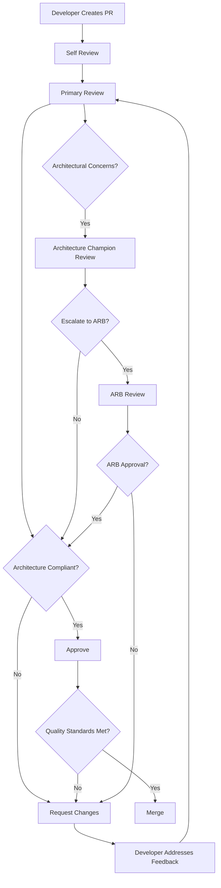

# Architecture Governance

This document establishes the processes and guidelines for maintaining architectural consistency in the Dirt iOS app as it evolves and grows.

## Table of Contents

- [Overview](#overview)
- [Governance Structure](#governance-structure)
- [Decision Making Process](#decision-making-process)
- [Architecture Review Process](#architecture-review-process)
- [Compliance Monitoring](#compliance-monitoring)
- [Evolution Management](#evolution-management)
- [Documentation Standards](#documentation-standards)

## Overview

### Purpose

Architecture governance ensures that:
- All development follows established architectural patterns
- Technical decisions are made consistently across teams
- Architecture evolves in a controlled and documented manner
- Quality standards are maintained throughout the codebase
- Knowledge is preserved and shared across the development team

### Principles

1. **Consistency**: All code follows established patterns and standards
2. **Transparency**: Architectural decisions are documented and accessible
3. **Collaboration**: Architecture evolves through team input and consensus
4. **Quality**: High standards are maintained through review and validation
5. **Adaptability**: Architecture can evolve to meet changing requirements

## Governance Structure

### Architecture Review Board (ARB)

#### Composition
- **Lead Architect**: Overall architecture vision and decisions
- **Senior iOS Developer**: iOS-specific technical expertise
- **UX Lead**: User experience and design system oversight
- **QA Lead**: Quality assurance and testing standards
- **Product Owner**: Business requirements and priorities

#### Responsibilities
- Review and approve architectural changes
- Maintain architectural standards and guidelines
- Resolve architectural conflicts and disputes
- Plan architectural evolution and roadmap
- Ensure compliance with established patterns

### Architecture Champions

#### Role Definition
Architecture Champions are developers who:
- Advocate for architectural best practices in their teams
- Provide guidance on architectural decisions
- Review code for architectural compliance
- Escalate architectural issues to the ARB
- Share architectural knowledge and updates

#### Selection Criteria
- Strong understanding of the current architecture
- Experience with iOS development and SwiftUI
- Good communication and mentoring skills
- Commitment to code quality and best practices
- Active participation in code reviews

## Decision Making Process

### Architecture Decision Records (ADRs)

#### When to Create an ADR
Create an ADR for decisions that:
- Affect the overall system architecture
- Introduce new patterns or technologies
- Change existing architectural patterns
- Impact multiple features or teams
- Have long-term implications for the codebase

#### ADR Template
```markdown
# ADR-XXX: [Decision Title]

## Status
[Proposed | Accepted | Deprecated | Superseded]

## Context
[Describe the situation that led to this decision]

## Decision
[Describe the architectural decision made]

## Alternatives Considered
[List and briefly describe alternative approaches]

## Consequences
### Positive
- [List positive outcomes]

### Negative
- [List negative outcomes or trade-offs]

### Neutral
- [List neutral implications]

## Implementation
[Describe how this decision will be implemented]

## Compliance
[Describe how compliance will be monitored]

## Related Decisions
[Link to related ADRs]
```

#### ADR Approval Process
1. **Draft**: Author creates initial ADR draft
2. **Review**: ARB reviews and provides feedback
3. **Discussion**: Team discusses implications and alternatives
4. **Revision**: Author revises based on feedback
5. **Approval**: ARB approves or requests further changes
6. **Implementation**: Decision is implemented and monitored

### Decision Categories

#### Automatic Approval
Decisions that follow established patterns:
- Adding new features using existing patterns
- Bug fixes that don't change architecture
- Performance optimizations within guidelines
- Documentation updates and improvements

#### Standard Review
Decisions requiring ARB review:
- New service implementations
- UI component additions to design system
- Changes to existing patterns
- New testing approaches
- Third-party library additions

#### Architectural Review
Decisions requiring full ARB approval:
- Changes to core architecture patterns
- New architectural patterns or approaches
- Breaking changes to existing APIs
- Major technology adoptions
- Cross-cutting concerns modifications

## Architecture Review Process

### Code Review Guidelines

#### Architecture Checklist
For every code review, verify:

**Service Layer**
- [ ] Uses dependency injection through ServiceContainer
- [ ] Follows established service patterns
- [ ] Implements proper error handling
- [ ] Includes comprehensive tests
- [ ] Documents public APIs

**UI Layer**
- [ ] Uses Material Glass design system components
- [ ] Follows SwiftUI best practices
- [ ] Implements proper accessibility support
- [ ] Supports Dark Mode correctly
- [ ] Includes UI tests for key interactions

**Feature Boundaries**
- [ ] Respects established module boundaries
- [ ] Minimizes cross-feature dependencies
- [ ] Uses shared services appropriately
- [ ] Places code in correct directories
- [ ] Follows naming conventions

**Quality Standards**
- [ ] Meets test coverage requirements
- [ ] Follows coding standards
- [ ] Includes proper documentation
- [ ] Handles edge cases appropriately
- [ ] Optimizes for performance

#### Review Roles

**Primary Reviewer**
- Reviews code for functionality and quality
- Ensures architectural compliance
- Provides constructive feedback
- Approves or requests changes

**Architecture Champion**
- Reviews for architectural consistency
- Validates pattern usage
- Escalates architectural concerns
- Provides architectural guidance

**Domain Expert**
- Reviews domain-specific logic
- Validates business requirements
- Ensures proper integration
- Provides domain knowledge

### Review Process Flow



### Architecture Review Triggers

#### Automatic Triggers
- Changes to Core/ directory
- New service implementations
- Changes to ServiceContainer
- Material Glass component modifications
- Navigation pattern changes

#### Manual Triggers
- Developer requests architecture review
- Primary reviewer has architectural concerns
- Architecture Champion identifies issues
- Complex feature implementations
- Cross-cutting concern modifications

## Compliance Monitoring

### Automated Compliance Checks

#### Static Analysis
```swift
// SwiftLint rules for architectural compliance
rules:
  # Service patterns
  - service_dependency_injection
  - service_protocol_usage
  - service_error_handling
  
  # UI patterns
  - material_glass_usage
  - accessibility_compliance
  - dark_mode_support
  
  # Architecture patterns
  - feature_boundary_respect
  - proper_imports
  - naming_conventions
```

#### Build-Time Validation
```bash
#!/bin/bash
# Architecture validation script

echo "Validating architecture compliance..."

# Check service registration
echo "Checking service registration..."
./scripts/validate_service_registration.sh

# Check Material Glass usage
echo "Checking Material Glass compliance..."
./scripts/validate_material_glass.sh

# Check feature boundaries
echo "Checking feature boundaries..."
./scripts/validate_feature_boundaries.sh

# Check test coverage
echo "Checking test coverage..."
./scripts/validate_test_coverage.sh

echo "Architecture validation complete."
```

#### Continuous Integration Checks
- Architecture compliance validation
- Test coverage requirements
- Performance regression detection
- Accessibility compliance verification
- Documentation completeness checks

### Manual Compliance Reviews

#### Monthly Architecture Audits
- Review recent architectural decisions
- Assess compliance with established patterns
- Identify areas for improvement
- Plan architectural evolution
- Update guidelines and documentation

#### Quarterly Architecture Health Checks
- Comprehensive codebase analysis
- Architecture debt assessment
- Performance and scalability review
- Technology stack evaluation
- Team feedback collection

### Compliance Metrics

#### Code Quality Metrics
- Test coverage percentage
- Code complexity scores
- Architecture compliance rate
- Code review feedback trends
- Bug density by architectural layer

#### Architecture Health Metrics
- Pattern consistency across features
- Service dependency complexity
- UI component reuse rate
- Documentation completeness
- Developer satisfaction scores

## Evolution Management

### Architecture Evolution Process

#### Identifying Need for Change
Changes may be needed due to:
- New business requirements
- Technology advances
- Performance issues
- Developer productivity concerns
- User experience improvements

#### Change Proposal Process
1. **Problem Identification**: Clearly define the issue
2. **Solution Research**: Investigate potential solutions
3. **Impact Analysis**: Assess impact on existing code
4. **Proposal Creation**: Create detailed change proposal
5. **Stakeholder Review**: Get feedback from affected teams
6. **ARB Approval**: Present to Architecture Review Board
7. **Implementation Planning**: Plan migration strategy
8. **Execution**: Implement changes incrementally
9. **Validation**: Verify successful implementation

#### Migration Strategies

**Incremental Migration**
- Implement new patterns alongside existing ones
- Gradually migrate existing code
- Maintain backward compatibility during transition
- Validate each migration step

**Feature Flag Migration**
- Use feature flags to control new architecture usage
- Test new patterns with subset of users
- Gradually roll out to all users
- Remove old patterns once migration complete

**Parallel Implementation**
- Implement new architecture in parallel
- Compare performance and quality
- Switch over when new implementation proven
- Remove old implementation

### Deprecation Process

#### Deprecation Lifecycle
1. **Announcement**: Announce deprecation with timeline
2. **Documentation**: Update documentation with alternatives
3. **Migration Guide**: Provide migration instructions
4. **Warning Period**: Add deprecation warnings to code
5. **Support Period**: Continue supporting during migration
6. **Removal**: Remove deprecated patterns/APIs

#### Deprecation Guidelines
- Provide at least 6 months notice for major changes
- Offer clear migration paths and documentation
- Support teams during migration process
- Monitor usage to ensure successful migration
- Communicate timeline and expectations clearly

## Documentation Standards

### Architecture Documentation Requirements

#### Core Documentation
- **Architecture Overview**: High-level system design
- **Service Documentation**: Service interfaces and usage
- **Design System Guide**: Material Glass component usage
- **Development Guidelines**: Coding standards and patterns
- **Testing Standards**: Testing requirements and approaches

#### Feature Documentation
- **Feature Specifications**: Requirements and design
- **API Documentation**: Service interfaces and contracts
- **Usage Examples**: Code examples and best practices
- **Testing Documentation**: Test strategies and coverage
- **Migration Guides**: Upgrade and migration instructions

### Documentation Maintenance

#### Regular Updates
- Review documentation quarterly
- Update examples and code snippets
- Verify accuracy of guidelines
- Add new patterns and approaches
- Remove outdated information

#### Documentation Reviews
- Include documentation in code reviews
- Validate examples and code snippets
- Ensure consistency across documents
- Check for completeness and clarity
- Update based on team feedback

### Knowledge Sharing

#### Architecture Presentations
- Monthly architecture updates
- New pattern introductions
- Best practice sharing
- Lessons learned sessions
- Technology trend discussions

#### Training Programs
- New developer onboarding
- Architecture pattern workshops
- Code review training
- Testing best practices
- Tool and technology training

#### Documentation Accessibility
- Centralized documentation repository
- Search functionality for easy discovery
- Version control for documentation changes
- Regular communication of updates
- Feedback mechanisms for improvement

## Enforcement Mechanisms

### Automated Enforcement
- Build pipeline architecture validation
- Code review automation tools
- Static analysis for pattern compliance
- Test coverage enforcement
- Performance regression detection

### Manual Enforcement
- Code review requirements
- Architecture champion oversight
- Regular compliance audits
- Team feedback and coaching
- Escalation to ARB for violations

### Continuous Improvement
- Regular process evaluation
- Team feedback incorporation
- Tool and automation improvements
- Training program updates
- Best practice evolution

---

*This governance framework should be reviewed and updated regularly to ensure it remains effective and relevant to the team's needs.*