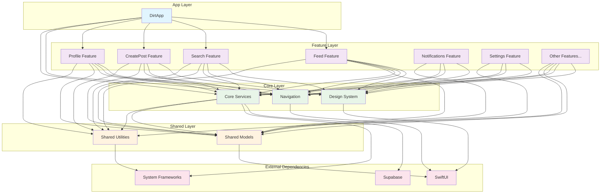
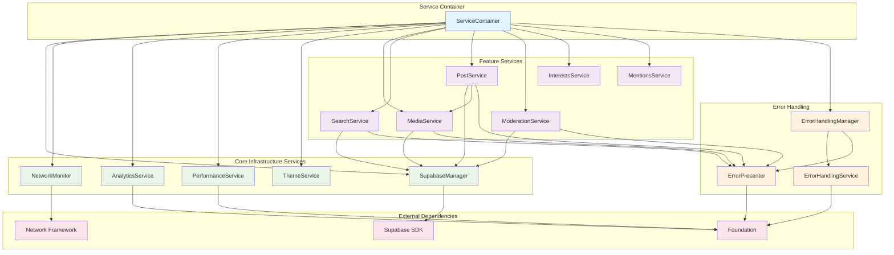
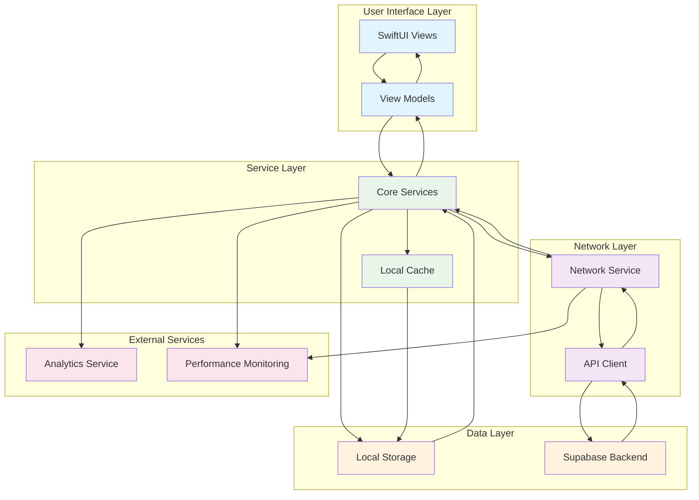

# Dependency Diagrams

This document provides visual representations of the module relationships and dependency flows within the Dirt iOS app architecture.

## Overview

The dependency diagrams show how different modules interact with each other, helping developers understand:
- Which modules depend on which others
- The direction of dependencies
- Potential circular dependencies
- Opportunities for decoupling

## High-Level Architecture Diagram



## Core Services Dependency Diagram



## Feature Module Dependencies

```mermaid
graph TB
    subgraph "Feed Feature"
        FeedView[FeedView]
        FeedViewModel[FeedViewModel]
        PostCard[PostCard]
    end
    
    subgraph "Search Feature"
        SearchView[SearchView]
        SearchViewModel[SearchViewModel]
        SearchResults[SearchResults]
    end
    
    subgraph "CreatePost Feature"
        CreatePostView[CreatePostView]
        CreatePostViewModel[CreatePostViewModel]
        MediaPicker[MediaPicker]
    end
    
    subgraph "Core Design System"
        GlassCard[GlassCard]
        GlassButton[GlassButton]
        MaterialColors[MaterialColors]
        MotionSystem[MotionSystem]
    end
    
    subgraph "Core Services"
        PostService[PostService]
        MediaService[MediaService]
        SearchService[SearchService]
        AnalyticsService[AnalyticsService]
    end
    
    subgraph "Navigation"
        NavigationCoordinator[NavigationCoordinator]
        NavigationRouter[NavigationRouter]
    end
    
    subgraph "Shared Models"
        PostModel[Post]
        UserModel[User]
        SearchQuery[SearchQuery]
    end
    
    %% Feed Feature Dependencies
    FeedView --> FeedViewModel
    FeedView --> PostCard
    FeedView --> GlassCard
    FeedView --> NavigationCoordinator
    FeedViewModel --> PostService
    FeedViewModel --> AnalyticsService
    FeedViewModel --> PostModel
    PostCard --> GlassCard
    PostCard --> GlassButton
    PostCard --> MaterialColors
    
    %% Search Feature Dependencies
    SearchView --> SearchViewModel
    SearchView --> SearchResults
    SearchView --> GlassCard
    SearchView --> NavigationCoordinator
    SearchViewModel --> SearchService
    SearchViewModel --> AnalyticsService
    SearchViewModel --> SearchQuery
    SearchResults --> GlassCard
    SearchResults --> PostModel
    
    %% CreatePost Feature Dependencies
    CreatePostView --> CreatePostViewModel
    CreatePostView --> MediaPicker
    CreatePostView --> GlassCard
    CreatePostView --> GlassButton
    CreatePostView --> NavigationCoordinator
    CreatePostViewModel --> PostService
    CreatePostViewModel --> MediaService
    CreatePostViewModel --> AnalyticsService
    CreatePostViewModel --> PostModel
    MediaPicker --> MediaService
    MediaPicker --> GlassButton
    
    %% Navigation Dependencies
    NavigationCoordinator --> NavigationRouter
    
    %% Styling
    classDef feature fill:#f3e5f5
    classDef design fill:#e8f5e8
    classDef service fill:#e1f5fe
    classDef navigation fill:#fff3e0
    classDef model fill:#fce4ec
    
    class FeedView,FeedViewModel,PostCard,SearchView,SearchViewModel,SearchResults,CreatePostView,CreatePostViewModel,MediaPicker feature
    class GlassCard,GlassButton,MaterialColors,MotionSystem design
    class PostService,MediaService,SearchService,AnalyticsService service
    class NavigationCoordinator,NavigationRouter navigation
    class PostModel,UserModel,SearchQuery model
```



## Material Glass Design System Dependencies

```mermaid
graph TB
    subgraph "Design System Components"
        MaterialDesign[MaterialDesignSystem]
        GlassComponents[GlassComponents]
        MotionSystem[MotionSystem]
        AccessibilitySystem[AccessibilitySystem]
    end
    
    subgraph "Design Tokens"
        DesignTokens[DesignTokens]
        MaterialColors[MaterialColors]
        Typography[Typography]
        Spacing[Spacing]
    end
    
    subgraph "Glass Components"
        GlassCard[GlassCard]
        GlassButton[GlassButton]
        GlassNavBar[GlassNavigationBar]
        GlassTabBar[GlassTabBar]
        GlassModal[GlassModal]
    end
    
    subgraph "Motion Components"
        Transitions[MaterialTransitions]
        Animations[MaterialAnimations]
        Gestures[MaterialGestures]
    end
    
    subgraph "Accessibility Components"
        A11yModifiers[AccessibilityModifiers]
        A11yHelpers[AccessibilityHelpers]
        A11yValidation[AccessibilityValidation]
    end
    
    subgraph "SwiftUI Framework"
        SwiftUI[SwiftUI]
        Material[Material Effects]
        Animation[Animation System]
        Accessibility[Accessibility APIs]
    end
    
    %% Design System Dependencies
    MaterialDesign --> DesignTokens
    MaterialDesign --> GlassComponents
    MaterialDesign --> MotionSystem
    MaterialDesign --> AccessibilitySystem
    
    %% Token Dependencies
    DesignTokens --> MaterialColors
    DesignTokens --> Typography
    DesignTokens --> Spacing
    
    %% Component Dependencies
    GlassComponents --> GlassCard
    GlassComponents --> GlassButton
    GlassComponents --> GlassNavBar
    GlassComponents --> GlassTabBar
    GlassComponents --> GlassModal
    
    %% Motion Dependencies
    MotionSystem --> Transitions
    MotionSystem --> Animations
    MotionSystem --> Gestures
    
    %% Accessibility Dependencies
    AccessibilitySystem --> A11yModifiers
    AccessibilitySystem --> A11yHelpers
    AccessibilitySystem --> A11yValidation
    
    %% SwiftUI Dependencies
    MaterialColors --> SwiftUI
    GlassCard --> Material
    GlassButton --> Material
    GlassNavBar --> Material
    GlassTabBar --> Material
    GlassModal --> Material
    
    Transitions --> Animation
    Animations --> Animation
    Gestures --> SwiftUI
    
    A11yModifiers --> Accessibility
    A11yHelpers --> Accessibility
    A11yValidation --> Accessibility
    
    %% Styling
    classDef designSystem fill:#e8f5e8
    classDef tokens fill:#e1f5fe
    classDef components fill:#f3e5f5
    classDef motion fill:#fff3e0
    classDef accessibility fill:#fce4ec
    classDef swiftui fill:#f0f0f0
    
    class MaterialDesign,GlassComponents,MotionSystem,AccessibilitySystem designSystem
    class DesignTokens,MaterialColors,Typography,Spacing tokens
    class GlassCard,GlassButton,GlassNavBar,GlassTabBar,GlassModal components
    class Transitions,Animations,Gestures motion
    class A11yModifiers,A11yHelpers,A11yValidation accessibility
    class SwiftUI,Material,Animation,Accessibility swiftui
```



## Data Flow Diagram



## Dependency Rules and Constraints

### Allowed Dependencies

1. **Features** may depend on:
   - Core Design System
   - Core Services (through Service Container)
   - Core Navigation
   - Shared Models
   - Shared Utilities
   - SwiftUI and system frameworks

2. **Core modules** may depend on:
   - Other Core modules (with careful consideration)
   - Shared Utilities
   - External frameworks
   - System frameworks

3. **Shared modules** may depend on:
   - System frameworks
   - External frameworks (minimal)

### Prohibited Dependencies

1. **Features** must NOT depend on:
   - Other Feature modules directly
   - Implementation details of Core modules

2. **Core modules** must NOT depend on:
   - Feature modules
   - Specific feature implementations

3. **Shared modules** must NOT depend on:
   - Feature modules
   - Core modules (except through well-defined interfaces)

### Circular Dependency Prevention

To prevent circular dependencies:

1. **Layered Architecture**: Dependencies flow in one direction (up the stack)
2. **Interface Segregation**: Use protocols to break tight coupling
3. **Dependency Injection**: Use service container to manage dependencies
4. **Event-Driven Communication**: Use notifications/events for loose coupling

## Dependency Analysis Tools

### Automated Dependency Checking

```swift
// Example: Architecture test to validate dependencies
class ArchitectureDependencyTests: XCTestCase {
    func testFeaturesDontDependOnOtherFeatures() {
        let featureModules = ["Feed", "Search", "CreatePost", "Profile"]
        
        for feature in featureModules {
            let dependencies = getDependencies(for: feature)
            let otherFeatures = featureModules.filter { $0 != feature }
            
            for otherFeature in otherFeatures {
                XCTAssertFalse(
                    dependencies.contains(otherFeature),
                    "\(feature) should not depend on \(otherFeature)"
                )
            }
        }
    }
    
    func testCoreModulesDontDependOnFeatures() {
        let coreModules = ["Design", "Navigation", "Services"]
        let featureModules = ["Feed", "Search", "CreatePost", "Profile"]
        
        for coreModule in coreModules {
            let dependencies = getDependencies(for: coreModule)
            
            for feature in featureModules {
                XCTAssertFalse(
                    dependencies.contains(feature),
                    "\(coreModule) should not depend on \(feature)"
                )
            }
        }
    }
}
```

### Dependency Visualization

Use tools like:
- **Xcode Build Timeline**: Analyze build dependencies
- **Swift Package Manager**: Visualize package dependencies
- **Custom Scripts**: Generate dependency graphs from import statements

## Migration Guidelines

When refactoring dependencies:

1. **Identify Current Dependencies**: Map existing dependencies
2. **Plan Target Architecture**: Design desired dependency structure
3. **Create Migration Path**: Plan incremental changes
4. **Implement Gradually**: Make small, testable changes
5. **Validate Architecture**: Use tests to ensure compliance
6. **Update Documentation**: Keep diagrams current

## Maintenance

These dependency diagrams should be:
- **Updated regularly** as the architecture evolves
- **Reviewed during** major architectural changes
- **Validated by** automated tests where possible
- **Used as reference** during code reviews

Last updated: [Current Date]
Next review: [Next Quarter]